<div align="center">

# Rainmaker

**An AI sales agent that runs the whole first call — and closes it.**

[](https://github.com/tasnimuldatascience/rainmaker/actions/workflows/ci.yml)
[](services/api/pyproject.toml)
[](packages/crdt)
[](#tests)
[](LICENSE)

<br>

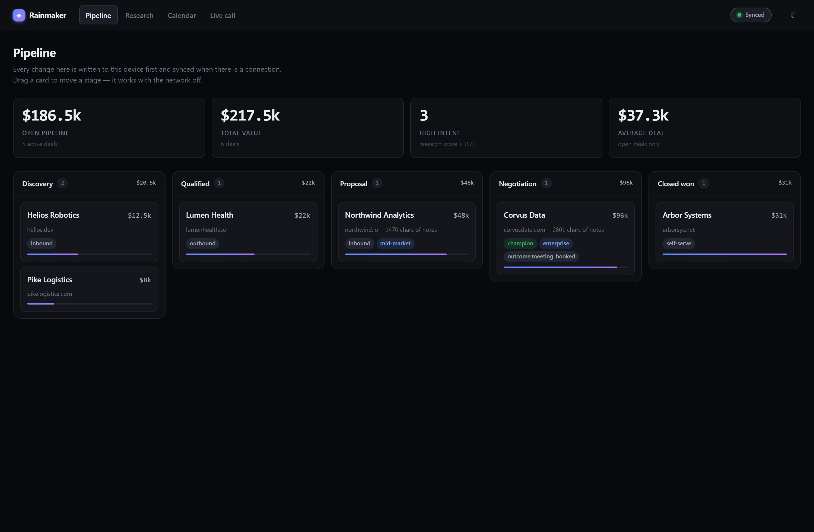

</div>

---

## What is this?

**A buyer lands on your website at eleven at night and nobody is awake.** Today they fill in a
form and wait two days for a rep. Rainmaker answers them instead — out loud, immediately, with
your product on the screen.

Give it your name, work email and company, and it runs a real sales call: it reads your business
before it speaks, works out what you need, drives its own product on screen while it talks you
through it, compares itself against what else you are looking at, quotes your number, and puts a
checkout in front of you. If the deal genuinely needs a person, it books one out of a real
calendar. **Nobody is waiting in a queue behind it, because there is nobody behind it.**

**That call is also the product.** Rainmaker sells the agent to other businesses, who configure
their own and put it on their own website. Ours is simply the first row in the table.

| Part | What it does |
|---|---|
| **The call** | An AI account executive you can type to or talk to. She answers out loud with her mouth moving to her own voice, says she is an AI before anything else, and stops selling the moment you ask for a person |
| **Research** | Reads the buyer's company from the domain in their work email — live, on screen — and only lets her state what it actually found |
| **The demo** | Drives the *seller's* product in a real browser while she narrates it. The opposite direction from research, through the same tool |
| **Closing** | A quote computed from published pricing, a comparison written by the tenant, and a hosted checkout. The agent never sees a card |
| **Tools** | A calendar, a CRM, a browser, a mailbox and a payment provider — reached over MCP, so a customer's own systems drop in |
| **Sales dashboard** | Where reps pick the deal up afterwards, with every call already on it |

---

## What a call actually does

Ten steps, and the agent is allowed to jump between them the moment the buyer says something
that means it should:

| | Step | What is decided in code |
|---|---|---|
| 1 | **Research** | The domain from the work address. Facts only, each with the page it came from |
| 2 | **Introduce** | The AI disclosure, verbatim, before anything else. Not switchable off |
| 3 | **Understand** | — the model's job, on a turn budget, because small models discover forever |
| 4 | **Show** | Which page of the product opens, and where it scrolls to |
| 5 | **Compare** | Every line of the comparison, quoted from what the tenant wrote |
| 6 | **Quote** | Seats, rate, discount, total — arithmetic, and the sentence that says them |
| 7 | **Close** | — the model's job |
| 8 | **Checkout** | The amount, and the refusal above the ceiling a person has to sign off |
| 9 | **Book a person** | The times, read from the calendar verbatim, and the confirmation |
| 10 | **Write it down** | The CRM record, the outcome, and the follow-up draft |

Steps 3 and 7 are the model's. Everything else is a decision the model is not consulted about,
and [the reason](#the-graph-decides-the-model-writes) is that Qwen2.5-1.5B is a good enough
writer for a discovery question and nowhere near reliable enough to confirm a meeting or name a
price.

**Work email, required.** The domain *is* the cold start — it is where the browser points before
she says a word — and it is also the qualifying question. A refusal is a sentence explaining why,
under the field that caused it.

---

## Run it

```bash
git clone https://github.com/tasnimuldatascience/rainmaker && cd rainmaker
npm install
pip install -e "services/api[dev]"

# terminal 1 — the backend
uvicorn rainmaker.app:app --app-dir services/api/src --port 8000

# terminal 2 — the dashboard
npm run dev            # http://localhost:5173
```

Open it, give her a work email, and talk. **That is the demo** — everything in the table above
happens on that call, with no key, no account and nothing paid for.

### Giving her the local brain and voice

The call works without this — she answers from a grounded script and the browser speaks. For the
real thing:

```bash
pip install -e "services/api[voice]"      # the voice: ~40MB of wheels
python scripts/fetch-models.py            # its weights: 330MB, Apache-2.0, no account

pip install -e "services/api[brain]"      # the model: torch, ~2.5GB
# Qwen2.5-1.5B-Instruct downloads itself on first start
```

And to make her mouth move:

```bash
python scripts/fetch-lipsync.py     # Wav2Lip, 436MB. Read the licence prompt — it is not Apache
```

Restart the API and `/api/calls/health` will say what loaded. So will the console.

The five tool servers need no setup — the API starts them itself. The calendar and CRM keep
working with no network, and payments run against a local mock provider that a clone can click
all the way through.

Optional, and everything works without them:

```bash
FIRECRAWL_API_KEY=fc-…     # use the real research API instead of the built-in browser
STRIPE_SECRET_KEY=sk_…     # take real money instead of the local mock checkout
OUR_CATEGORY="vector search,learning-to-rank"   # rank job posts mentioning these highest
RAINMAKER_VOICE=browser    # force the fallback voice, to hear the difference
RAINMAKER_MAX_CHARGE=…     # the ceiling above which a person has to sign, in minor units
RAINMAKER_CALLS_PER_VISITOR_HOUR=…   # raise the rate limit; the screenshot script needs this
```

---

## The dashboard works with no internet

Not "shows you a cached page". **Turn off your wifi, reload the browser tab, and everything still
works.** Edits save. When the connection returns, they sync.

<div align="center">
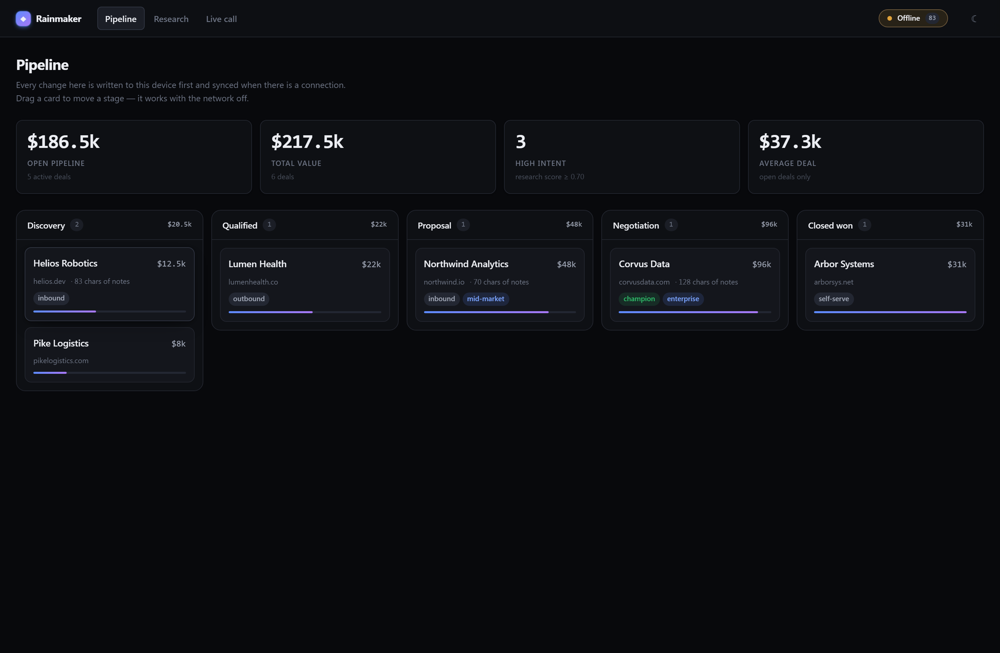
<br>
<sub>Taken with the network genuinely disconnected, then a full page reload. The badge shows
<b>83 edits saved on the device</b>, waiting to sync.</sub>
</div>

This is a property of the pipeline board, not a pitch: a rep on a train should be able to work
the deals the agent filled the board with. The interesting engineering is below.

### How it works

Normally, saving something means asking a server and waiting. If the server cannot be reached,
you get an error and your work is stuck.

Rainmaker never asks. Every edit is saved on your device immediately, and the change is queued to
send later. The server's only job is to collect changes and pass them on — **it never decides who
wins.**

That raises an obvious problem: what if two people edit the same deal while both are offline?

The answer is a **CRDT** — a way of storing data where changes can arrive in any order, or twice,
or years late, and everyone still ends up with the same result.

### Testing it properly

You cannot test this with a handful of examples, because the bugs live in orderings nobody thinks
to write down.

So the tests generate **300 random sequences of edits**, deliver them to two devices in different
orders, and check both end up identical:

```
For any set of edits, delivered in any two orders:
    device A's result  ==  device B's result
```

That found two bugs that reading the code had missed. Both were the same shape:

> **A deletion arriving before the thing it deletes.** Delete a character, and if that deletion
> reaches the other device before the original typing does, the character comes back — on one
> device only.

The failing case the test found was two operations long. Nobody would have written that test
by hand.

### Two versions of the same rules

The dashboard merges changes in TypeScript. The backend does the same in Python.

Two implementations of the same rule **will** drift apart eventually, and when they do, the
dashboard and the backend quietly disagree about a customer's deal. Nothing errors. Nobody
notices.

So the TypeScript version runs seven scenarios and records what it decided. The Python tests then
check they agree. These recordings are **generated by running the real code**, never written by
hand — a hand-written expectation only records what the author *believed* both sides do, which is
exactly the thing being tested.

---

## Research that cannot make things up

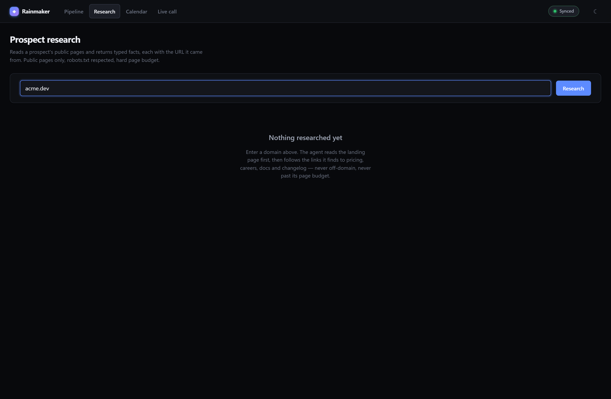

Every fact comes with a label saying where it came from:

| Label | Meaning |
|---|---|
| **Seen** | These exact words appear on a page we read. You can quote it |
| **Worked out** | Calculated from things we saw, by a written-down rule. No AI involved |
| **AI guess** | An AI's interpretation — **and it must show the text it was reading** |

That last rule is enforced by the code, not by convention:

```python
Sourced[str](value="fintech", provenance=Provenance.INFERRED)
# ValueError: an INFERRED value must carry the excerpt it was inferred from;
#             an unsourced inference is a guess wearing a schema
```

**This is deliberately not "an AI with a web browser."** It follows a fixed list of pages, has a
hard limit on how many it will read, and pulls out facts using ordinary code. The AI only adds
clearly-labelled guesses on top, and **can never overwrite something that was actually seen.**

Run it twice on the same company and you get byte-for-byte identical results.

**It also stays in bounds**, enforced in code: public pages only, never any login, obeys
`robots.txt` including the requested delay between requests, one request at a time per website,
and the page limit counts *attempts* rather than successes.

---

## The call

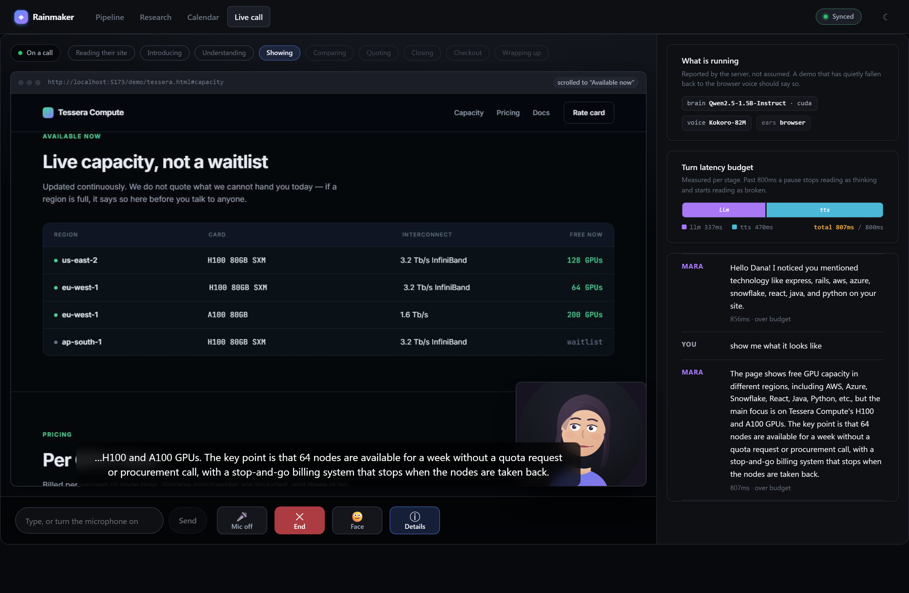

That is one screenshot of one real call. A name, a work email and a company went into the form;
everything after it happened by itself.

**It is shaped like a video call, because that is what it is** — the other party happens to be an
agent. A lobby with their tile and their disclosure, a stage that fills the window, the shared
screen in the middle, a presenter tile in the corner, captions across the bottom, and a control
bar. The engines, the latency budget and the transcript are one button away rather than
permanently alongside: on a call the thing worth looking at is the call.

**1 — She reads their business before she says a word.** Not a lookup: a browser opens the pages
behind their email domain and pulls out facts, each with the page it came from.

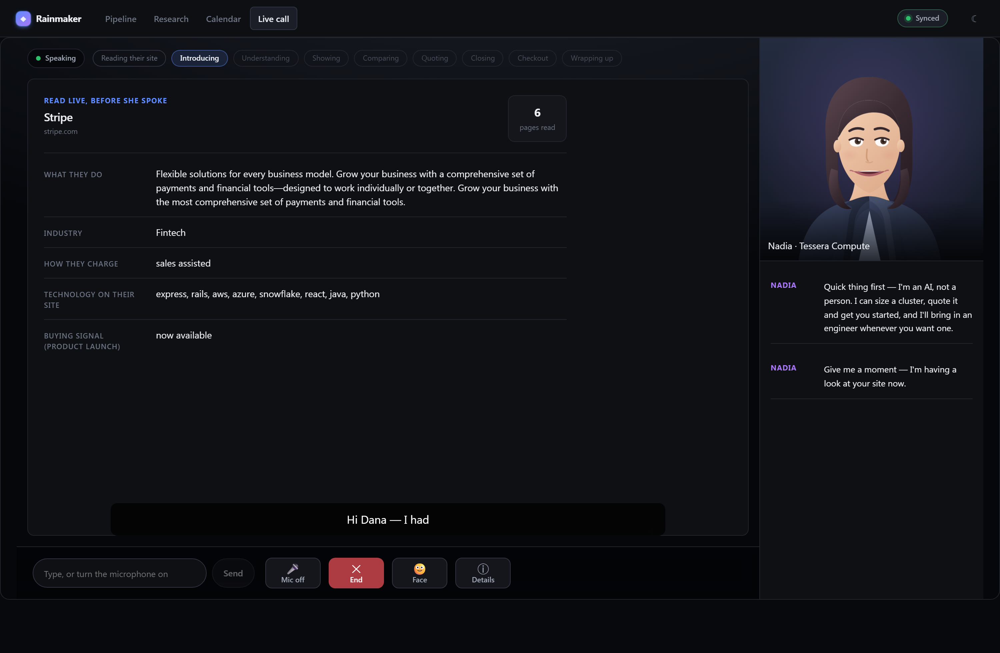

**2 — Then she drives the product.** A real browser opens *our* pages — not theirs — and **scrolls
to the thing she is about to talk about while you watch**, because a screen share is a page
moving under a window and a still of the right part of the page is a screenshot. She narrates
what is on screen against the problem they just described.

Those two steps use the same browser tool in opposite directions, and confusing them is a real
mistake with a real cost: for a while the demo consisted of narrating the prospect's own homepage
back at them. The prompt now names both companies and says which one owns the page on screen.

**3 — She is fair about the competition.** Every line of the comparison is quoted from what the
tenant wrote. A comparison table a language model composed about a named competitor is a
defamation risk with a grid layout.

**4 — Then her number.** Quantity from what they said, rate and discount from published pricing,
computed in code — and the sentence that states it is written in code too, the way the calendar
writes its own times. The model is told the figure is already said and asked to do the one thing
it is good at: ask whether it works.

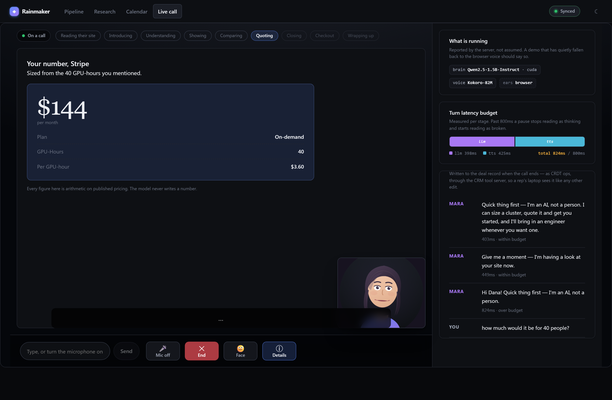

It is also the only place the model is *prevented* rather than instructed: see
[the price guard](#the-graph-decides-the-model-writes).

**5 — And a checkout.** A hosted page on the payment provider's domain. The agent never sees a
card, which is what keeps card data out of this product entirely rather than in it and managed.

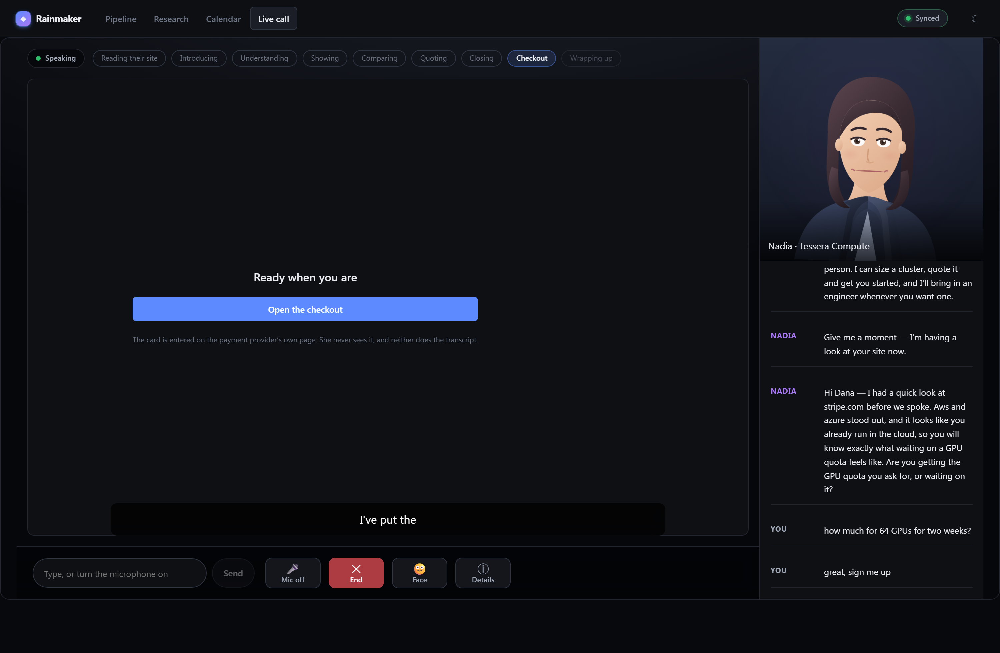

**6 — A person, if the deal actually needs one.**

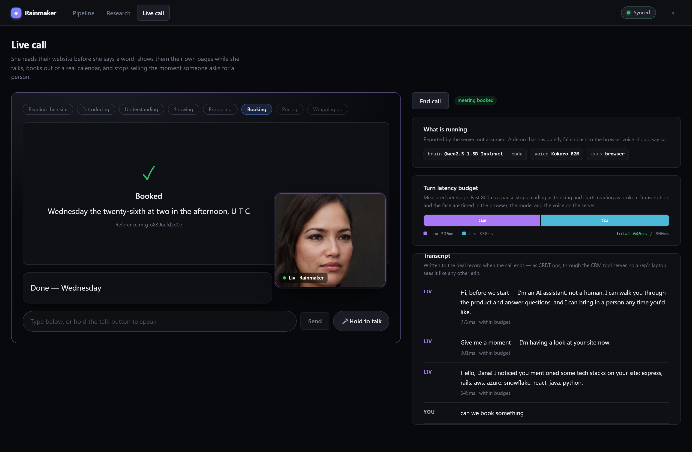

This is the escalation, not the goal — the whole point is that nobody waits for a rep. Ask for a
human and she stops selling on the spot; what follows the fixed line is a diary rather than a
promise.

The whole call is then written into the pipeline as CRDT ops through the CRM tool server, so a
rep's laptop sees it like any other edit — **including the calls that ended because somebody
closed the tab**, which is most of them.

### The graph decides, the model writes

The step the call is on, which tool fires, and every sentence where being wrong costs something —
the disclosure, the times offered, the booking confirmation, the handoff — are all decided in
code. The model writes the greeting, the questions, and the narration.

That split is the whole design. A model that phrases a question awkwardly costs a moment. A model
that decides on its own to confirm a meeting books nothing and promises everything, and
Qwen2.5-1.5B is nowhere near reliable enough to be trusted with the difference.

Two things she will not do, both enforced rather than requested:

```python
Disclosure(required=False)
# DisclosureError: AI disclosure cannot be disabled. If a deployment believes it needs
#                  to, that is a legal question, not a configuration one.
```

Ask for a human and she stops selling immediately — one fixed line, and the model is never
consulted about whether to agree. She is also held to two sentences a turn in code: asked
politely, the model wrote four to six every time and got cut off mid-word by the token limit.

**And the model cannot say a price at all**, which is enforced in the token stream rather than
requested in the prompt. That distinction was not academic: asked what capacity was available,
Qwen answered *"starting from $50 per GPU per hour"* about a product whose rate card says $2.40.
Every other part of the design was already right — the quote is arithmetic, the sentence stating
it is written in code, the prompt says the figure has already been read out — and none of it
mattered, because nothing was checking. A figure now never reaches synthesis: it is replaced,
mid-stream, before it can be spoken. The platform's own computed sentences do not pass through
that filter, which is the whole distinction — **the platform may state a number it worked out,
and the model may not state one at all.**

### Her tools are a protocol, not an integration

Five MCP servers, each runnable on its own in any MCP host:

```bash
python -m rainmaker.mcp.servers.calendar    # availability, booking, cancellation
python -m rainmaker.mcp.servers.crm         # call outcomes, as CRDT ops
python -m rainmaker.mcp.servers.research    # a page's text, and a picture of it
python -m rainmaker.mcp.servers.email       # the follow-up. Drafts always; sends with SMTP
python -m rainmaker.mcp.servers.payments    # hosted checkout. Mock until a key says otherwise
```

They run as separate processes so a third-party server that hangs cannot take a live call with
it, and every call has a deadline. Swapping the local calendar for a customer's Google Calendar
is a line in `mcp.toml` — the point of building it this way rather than as a function she calls.

The calendar will not sell the same slot twice, and that is enforced by a unique index rather
than by code, because listing times and booking one are separated by a conversation.

### Taking the money without touching a card

The agent asks the payment server for a hosted checkout built from the quote object and shows the
link. The card is entered on the processor's page, on the processor's domain, in the buyer's own
browser. **Nothing in this repository, in the model's context, or in a transcript ever contains a
card number** — which keeps the product out of PCI scope rather than putting it in and managing
it, and is why the tools have no parameter that could carry one.

Two rules the code enforces rather than asks for:

| | |
|---|---|
| **The amount is arithmetic** | It comes from `Quote`, which multiplies published pricing by a seat count the conversation established. An agent that invents a meeting wastes a slot; an agent that invents an amount takes somebody's money |
| **There is a ceiling** | Above it the tool refuses and hands back a sentence about getting a person, because an agent that can raise an unbounded charge is a headline |

Without a key it runs a **mock provider**: a real page, a real record, a real `paid` state, and no
money. That is deliberate — a payment step nobody can click through is a payment step nobody has
debugged, and it is what the fifteen tests in `test_payments.py` run against. With
`STRIPE_SECRET_KEY` set it creates real Checkout Sessions instead, and `mark_paid` starts
refusing outright: there, the processor's webhook is the only thing allowed to say a checkout was
paid.

### Why it does not pause awkwardly

People tolerate about 300ms of silence. Past about 800, a pause stops sounding like thinking.

Nothing waits for the previous thing to finish: synthesis starts on the first few words of a
reply, and clause two is produced while clause one is playing. Measured on the same 175-character
reply:

| | Silence before the first sound |
|---|---:|
| Synthesise the whole reply, then play it | 3007ms |
| Synthesise the first clause first | **407ms** |

Fifteen real turns: **850ms median** from pressing send to hearing her — the model ~140ms, the
voice ~720ms. The console shows the breakdown per turn, and on this hardware it usually goes
slightly over budget. Synthesis is why, and [ARCHITECTURE.md](ARCHITECTURE.md) says why the GPU
fix was not taken.

### Her face, and why there are two of them

Every agent's portrait is a **photoreal picture of nobody** — a StyleGAN face from an Apache-2.0
set, not a real person's likeness — and **its mouth is generated from the audio being spoken**.
Wav2Lip runs on the local GPU against the same Kokoro clip the browser is about to play.

That is the stronger claim and the weaker picture. A photograph cannot blink, cannot look
anywhere and cannot move its head, so a still face with a moving mouth lands at the bottom of the
uncanny valley — and every person shown it said so in the same words. **The console therefore
opens on an illustrated face instead**, a vector viseme rig that blinks irregularly, drifts and
re-fixes its eyes, lifts its brows on stressed syllables and tilts its head while listening. Its
shapes come from spelling, which is a poor guide to pronunciation, but its mouth *opens* on the
measured amplitude of the audio actually playing — so the half a viewer notices is real. One
button switches between them and the choice is remembered.

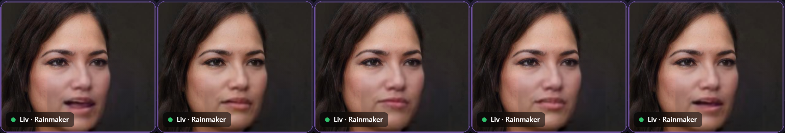

Those are consecutive frames of one sentence. Nothing is warped or interpolated; each mouth was
generated for the audio playing at that instant.

It is fast enough to sit inside a conversation for three reasons, none of them clever:

| | |
|---|---|
| **The face never changes** | A video pipeline detects a face per frame. There is one photograph here, so the crop is computed once and the 90MB face detector never enters the process |
| **It runs per clause** | Synthesis already streams clause by clause, so a clip is one to three seconds — one batched forward pass |
| **Only the mouth is generated** | A 96×96 patch travels to the browser, not a frame of video. About 2.5KB each |

**Seventeen times realtime once warm**, and the audio never waits for it: the clip goes out the
instant it exists and the frames follow, syncing to the audio's already-scheduled start. Worst
case her mouth joins a beat into the first clause. The voice is never held up for the face.

Without the checkpoint the photograph simply holds still, lit by the real output level, and the
console's badge says so. Nothing is faked to cover the gap.

> [!IMPORTANT]
> **Wav2Lip's weights are for academic and personal use, not commercial use.** Everything else
> here is Apache-2.0, MIT or public domain; this is the exception, which is why it is an opt-in
> `scripts/fetch-lipsync.py` rather than something a clone downloads, and why the licence is a
> prompt rather than a line in a log. For commercial work the same interface takes a hosted
> provider.
>
> **MuseTalk is the better model and does not run on this machine at all** — it pins
> `torch 2.0.1+cu118`, whose newest architecture is `sm_90`, and this GPU is `sm_120`. It also
> wants mmcv built from source and quotes five minutes of compute per eight seconds of video on
> a laptop card. `calls/avatar.py` has the details rather than leaving an adapter nobody can run.

---

## The same agent, on someone else's website

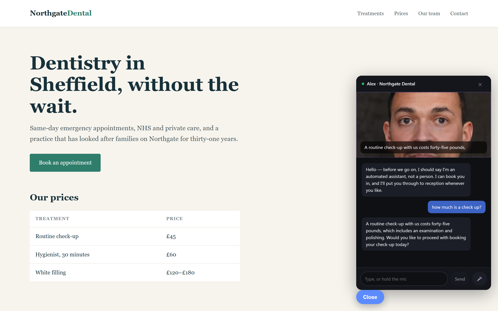

That is not our console. It is a GPU cloud's website — different fonts, different colours, nothing
shared — and the agent in the corner is **theirs**: their name, their voice, their face, their
disclosure wording, their competitors, and no email server granted. It quotes **$2.40 per
GPU-hour** because their rate card says $2.40 per GPU-hour, and the word *GPU-hour* comes from
their pricing rather than from our platform, which called everything a seat until a tenant sold
something else.

The entire integration is one tag:

```html
<script src="https://your-rainmaker/embed.js" data-key="rk_..." defer></script>
```

Two kilobytes, and it makes an iframe. Everything real — the socket, the audio graph, the face —
runs on our origin inside that frame, because a marketing site is a pile of somebody else's CSS
and a tag manager, and because microphone permission should be scoped to us rather than to them.

### An agent is a row, not a release

```python
AgentSpec(
    tenant="tessera", agent_id="alex",
    name="Alex", company="Tessera Compute", voice="male-warm",
    knowledge=(Fact("H100s by the hour, in clusters of up to 64…", source="positioning"),),
    pricing=(Tier("Reserved", "$2.40 / GPU-hour", unit_amount=240, unit_name="GPU-hour"),),
    competitors=(Competitor(name="a hyperscaler", …),),
    tools=("calendar", "crm", "research", "payments"),   # no email server: not granted, not reachable
    guardrails=Guardrails(disclosure="Quick thing first — I'm an AI, not a person…"),
)
```

That agent runs all ten steps of the call on a business nothing like ours — hours instead of
seats, engineers instead of sales teams — which is a stronger claim than a second SaaS company
with our shape and a different logo. It is also where the research step earns its keep: their
buyer is identifiable from a careers page, so "I saw you're hiring two ML engineers" is a real
buying signal for compute rather than a party trick.

Versions are immutable and publishing is a pointer move, so rolling back a bad change is one
call and a publish cannot alter an agent underneath somebody mid-conversation with it.

**What a tenant may change** — name, persona, objective, voice, face, knowledge, prices and the
unit they are priced in, competitors, the tour, which fields the front door asks for, and how
each step of the call is framed.

**What they may not** — that the agent discloses it is an AI, that it hands over when asked for a
person, that it may only state what its knowledge holds, that it can reach a tool nobody granted
it. Those four are the difference between selling software and inheriting someone else's
liability: when a buyer is told something untrue, the sentence in the complaint is *"the vendor's
AI said it"*. Being unable to switch the disclosure off is also the answer to every customer's
compliance review.

### The visitor is a stranger

Which changes the threat model completely, and is why the agent's knowledge is looked up
server-side from the published spec rather than sent by the page. There used to be a message
that let the client supply it — fine while the only client was our console, and an open door the
moment the caller is the one holding the socket.

Every call is admitted before anything expensive happens: concurrency against the GPU, hourly
caps per visitor and per agent, and limits on turns and duration for the tab somebody walked
away from. Every refusal carries a sentence, because a `429` on a dental practice's homepage is
worse than the call it prevented.

---

## The dashboard

<table>
<tr>
<td width="50%">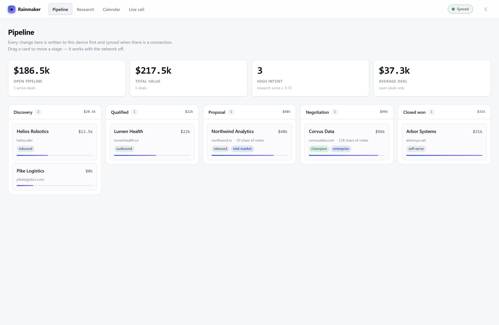</td>
<td width="50%">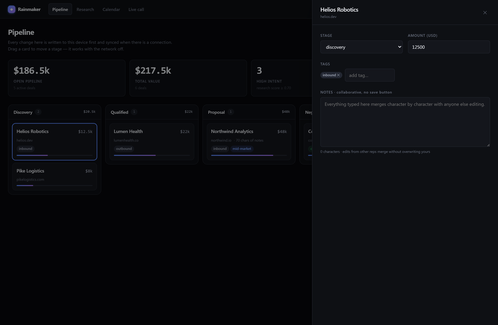</td>
</tr>
<tr>
<td align="center"><sub>Light theme — properly designed, not just inverted</sub></td>
<td align="center"><sub>Notes merge letter by letter. No save button, because there is nothing to save</sub></td>
</tr>
</table>

---

## Tests

```bash
npm test                       # 53 tests — syncing, text editing, the call surface
pytest                         # 438 tests — research, syncing, the API, the live call, the tools
```

491 tests in total. None of them load a language model: a test that spends six seconds on
Qwen to check that a WebSocket sends JSON is testing Qwen.

| Test file | What it protects |
|---|---|
| `convergence.test.ts` | Everyone ends up with the same data, whatever order changes arrive in — plus that the order is actually *correct* |
| `diff.test.ts` | Typing in a shared note produces the right text, including emoji and accents |
| `test_research.py` | The research agent cannot invent facts, wander onto other websites, or read more pages than allowed |
| `test_sync.py` | Duplicate changes, saving before broadcasting, slow clients, and TypeScript ↔ Python agreement |
| `test_app.py` | **The offline flush endpoint.** Reconnect, retry, deduplicate, and never half-apply a batch |
| `test_pipeline.py` | That a call cannot start without the AI disclosure, that every stage of the turn is measured, and that a price the model invented never reaches the speaker |
| `test_call.py` | Where a reply is cut for synthesis, what the agent is allowed to claim, and that asking for a human ends the sell without the model being consulted |
| `test_agenda.py` | That she researches before she greets, that the page she opens is ours and not theirs, that the times she offers come from the calendar and not the model, and that typing over her introduction does not kill the call |
| `test_payments.py` | That the amount comes from the quote and not the conversation, that nothing above the ceiling goes through without a person, and that there is no parameter anywhere that could carry a card number |
| `test_mcp.py` | That the calendar cannot sell the same slot twice, that a dead tool server degrades the call instead of ending it, that she will not email anyone who was not on the call, and that the CRM accepts every outcome the agenda can actually produce |
| `test_admission.py` | Who may start a call once the agent is on a stranger's website, and that every refusal is a sentence rather than a status code |
| `test_agents.py` | The line between what a customer may configure and what the platform enforces — a tenant who can switch off the AI disclosure is a liability the vendor inherits |
| `test_lipsync.py` | The spectrogram her mouth is driven by — a mel that is subtly wrong makes her lip-sync confidently to the wrong sounds, which looks like a bad model rather than a bad constant |
| `test_avatar.py` | That the face admits what it is: synthetic, and not lip-syncing unless a provider is actually doing it |
| `test_readme.py` | That these counts are the counts. A badge is an image, and nobody proofreads an image |

### The bug the API tests found immediately

`/api/sync/append` — the path a console uses to flush its offline queue — **could not accept a
request body at all.** Every POST returned:

```json
422  {"detail":[{"type":"missing","loc":["query","req"],"msg":"Field required"}]}
```

The request model was declared inside `create_app()`. With `from __future__ import annotations`
every annotation is a string that FastAPI resolves against the *module's* globals, and a class
defined in a function body is not in them — so the parameter silently degraded to a query
parameter.

**It went unnoticed because its failure is silent by design.** The console only reaches for this
path when the WebSocket is unavailable — *"it works in situations the WebSocket does not (some
corporate proxies)"* — and a failed flush leaves the ops queued for retry rather than surfacing an
error, because from the user's point of view the write already succeeded locally. So on exactly
the networks the fallback exists to serve, nothing ever synced and nobody was told.

The endpoint had no tests. It now has eleven.

### And one it found on the second look

A batch containing one malformed op was rejected with 422 *after* persisting the good ops before
it. The console retries the whole batch on failure, so the bad op failed forever while the good
ones deduplicated: the outbox never drained, and still nothing surfaced. Ops are validated in full
before anything is written now — one poison op rejects its batch rather than half-applying it.

### A bug that convergence testing could not find

The 300 randomised runs check that two devices **agree**. They passed throughout while shared
notes were quietly scrambling, because both devices agreed on the same wrong answer — and
agreeing on a wrong answer is still agreeing.

Characters were ordered by comparing their ids as text. Ids look like `alice:6` and `alice:10`,
and as text `"alice:10"` sorts before `"alice:6"`, because `1` comes before `6`. **So notes
started scrambling after about ten keystrokes.**

The first attempted fix — read the number properly and compare it numerically — was also wrong,
and broke the case the first bug was hiding: those numbers count per person, so one person's
edit number 0 can happen long after another person's edit number 5. Two people typing in the
same sentence got their words tangled with text that predated them both.

Both are now ordered by timestamp, which is the only value that compares meaningfully across
people. It took a test that checked **what the text actually said**, rather than that two copies
matched.

---

## Project layout

```
packages/crdt          the offline-syncing data structures     (TypeScript)
apps/console           the dashboard and the call surface       (React)
services/api
  calls/
    intake.py          name, work email and company become a domain to research
    agenda.py          the plot: which step, which tool, which words are fixed
    pipeline.py        the turn loop, the latency budget, the disclosure
    providers.py       the local model and the local voice
    avatar.py          which face is on screen, and what it admits to
    admission.py       who may start a call once the agent is on a stranger's site
  agents/
    spec.py            what a tenant may configure, and what they may not
    quoting.py         seats, rate, discount, total — and the sentence that says them
    store.py           versioned specs; publishing is a pointer move
  mcp/
    client.py          spawns the tool servers, routes calls, enforces deadlines
    servers/           calendar, crm, research, email, payments — each runnable alone
  research/            reading websites and extracting facts
  sync/                collecting and relaying changes
  crm/                 turning changes into a readable view
```

Nothing above `sync/` knows how a change arrived. Nothing above `research/extract` knows how a
page was fetched. See [ARCHITECTURE.md](ARCHITECTURE.md) for the decisions and what was rejected.

---

## Licence

MIT. Not affiliated with River. An original system exploring the same problem.
